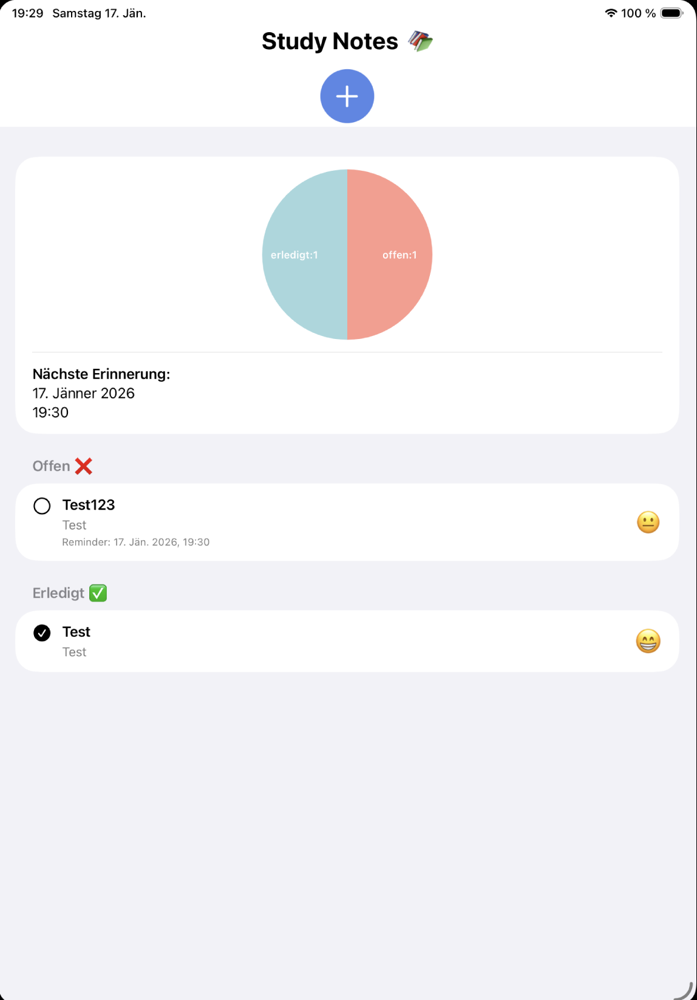

# Study-Notes App

The Study-Notes app is an Swift application designed to create and manage learning tasks. It helps users keep track of which tasks are still open and which have already been completed. The goal is to organize learning content in a structured way and support students throughout the school year.

---

## Features

- View all open and completed learning tasks on the home screen  
- Create new learning tasks with a **title** and **description** (mandatory fields)  
- Edit existing tasks by tapping on them  
- Delete tasks using a **swipe-to-delete** gesture  
- Mark tasks as completed using a selection button  
- Set **time-based reminders** for tasks  
- Attach learning materials from the **photo gallery**  
- Assign an **emoji** to represent current learning progress  

---

## Screenshots

  
  


---

## Installation & Build

### Clone the repository
```bash
git clone https://github.com/ThoBau25/Study-Notes-App.git
cd Study-Notes-App
